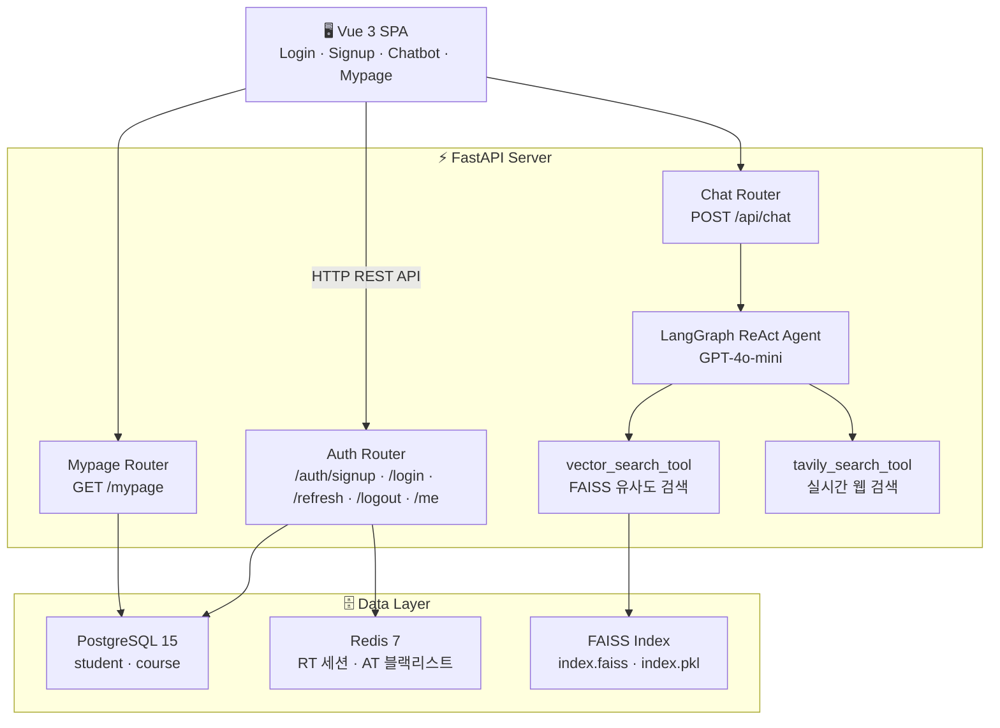
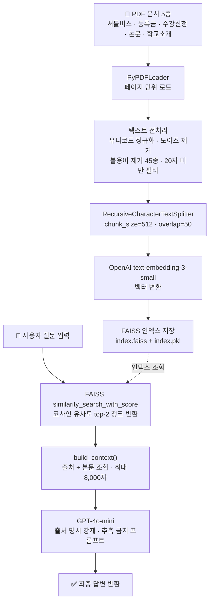
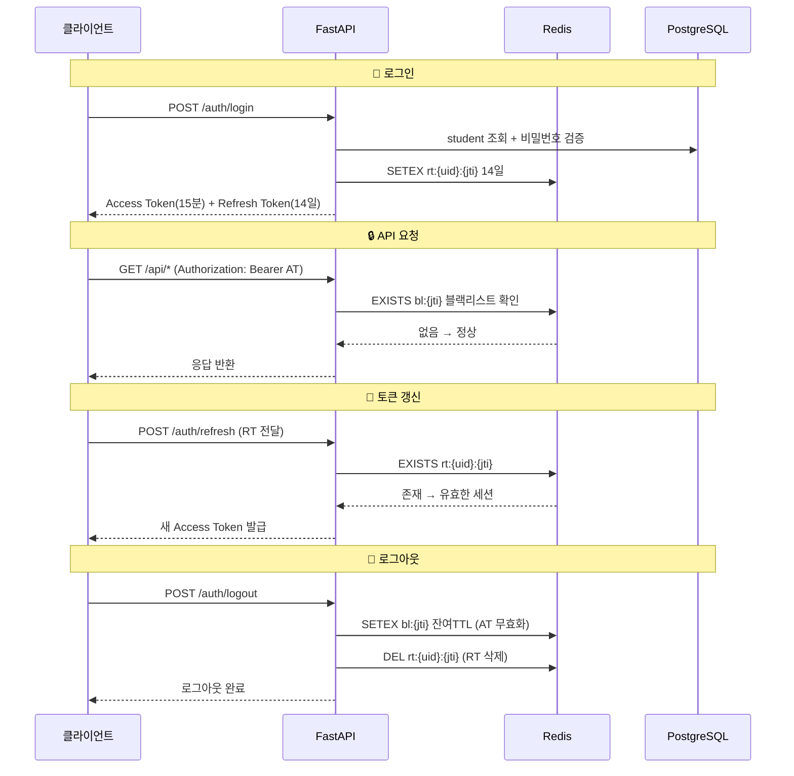
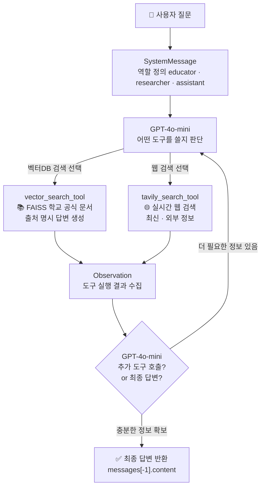
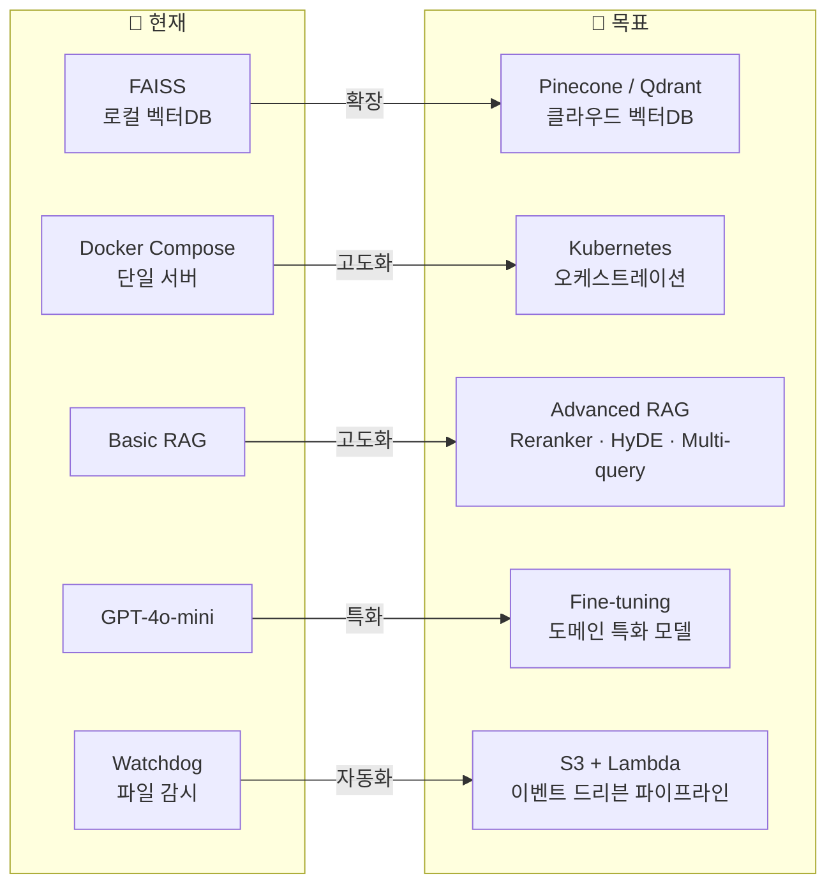

# 🤖 AI 서비스 개발자 포트폴리오

> RAG · LLM Agent · Full-Stack AI Service를 설계하고 직접 구현합니다.

---

## 👋 About Me

```
AI 서비스 개발자 | LLM Application Builder | Backend Engineer
```

LLM 기반 AI 서비스를 **기획부터 배포까지 End-to-End로 구현**하는 개발자입니다.  
RAG 아키텍처와 LangGraph Agent를 활용해 실제 도메인 문제를 해결하는 시스템을 만드는 데 집중합니다.  
단순히 모델을 호출하는 것을 넘어, **인증·캐시·벡터DB·비동기 처리**가 통합된 프로덕션 수준의 AI 서비스를 구성할 수 있습니다.

---

## 🛠 Tech Stack

### AI / LLM


| 분류 | 기술 |
|------|------|
| LLM Framework | LangGraph, LangChain |
| Model | OpenAI GPT-4o-mini |
| Embedding | OpenAI text-embedding-3-small |
| Vector DB | FAISS |
| Web Search | Tavily Search API |
| Agent Pattern | ReAct (Reasoning + Acting) |

### Backend
| 분류 | 기술 |
|------|------|
| Framework | FastAPI, Uvicorn |
| Language | Python |
| ORM | SQLAlchemy (Async + asyncpg) |
| Auth | JWT (PyJWT) |
| Cache | Redis 7 |
| DB | PostgreSQL 15 |

### Frontend & Infra
| 분류 | 기술 |
|------|------|
| Frontend | Vue 3, TypeScript, Tailwind CSS |
| Infra | Docker, Docker Compose |
| Monitoring | Watchdog, Rich |

---

## 💼 Projects

---

### 📚 순천향대학교 AI 챗봇 서비스

> PDF 기반 RAG 아키텍처 + LangGraph ReAct Agent + JWT 인증 시스템을 통합한 대학교 AI 어시스턴트

| 항목 | 내용 |
|------|------|
| 기간 | 2024 |
| 유형 | 개인 프로젝트 |
| 역할 | 기획 · AI 파이프라인 · 백엔드 · 프론트엔드 전체 구현 |
| GitHub | [🔗 Repository Link](#) |

#### 🎯 프로젝트 배경 & 문제 정의

학교 학사 정보(수강신청, 셔틀버스, 등록금, 논문 작성 등)는 여러 PDF에 분산되어 있어  
학생들이 필요한 정보를 찾는 데 어려움을 겪고 있었습니다.  
이를 해결하기 위해 **공식 문서를 벡터화하여 AI가 정확한 출처 기반 답변을 제공**하는 서비스를 구축했습니다.

#### ✨ 핵심 기능

- **RAG 파이프라인**: PDF → 전처리 → 임베딩 → FAISS 저장 → 유사도 검색 → GPT 답변 생성
- **ReAct Agent**: LangGraph 기반 LLM이 벡터 검색과 웹 검색을 스스로 선택·조합하여 응답
- **JWT + Redis 인증**: Access Token 블랙리스트 + Refresh Token 세션 관리
- **PDF 자동 감지**: Watchdog으로 새 문서 추가 시 자동 증분 임베딩

#### 🏗 시스템 아키텍처



#### 🤖 RAG 파이프라인 상세



#### 🔐 JWT + Redis 인증 설계

| 항목 | Access Token | Refresh Token |
|------|-------------|---------------|
| 유효기간 | 15분 | 14일 |
| Redis 키 | `bl:{jti}` (블랙리스트) | `rt:{user_id}:{jti}` |
| 무효화 방식 | TTL 자동 만료 | DEL 명령 |

**핵심 설계 포인트**: JWT는 stateless라 서버에서 강제 만료가 불가능하다는 문제를,  
로그아웃 시 JTI를 Redis 블랙리스트에 등록하고 잔여 만료 시간을 TTL로 설정해 해결했습니다.  
TTL 만료와 동시에 Redis 메모리가 자동 정리되는 무낭비 구조입니다.



#### ⚡ 기술적 도전 & 해결

| 문제 | 해결 방법 |
|------|-----------|
| 서버 재시작 시 중복 임베딩 발생 | FAISS docstore `metadata.source` 순회로 이미 인덱싱된 파일 스킵 |
| PDF 추가 시 전체 재임베딩 필요 | `add_documents()`로 증분 업데이트, Watchdog으로 파일 안정화 확인 (3회 연속 크기 동일) 후 임베딩 |
| 한글 경로에서 FAISS 저장 실패 | ASCII 인코딩 시도로 비ASCII 경로 감지 → 자동으로 ASCII 경로로 대체 |
| FastAPI 이벤트 루프 블로킹 | asyncpg + AsyncSession으로 전체 DB I/O 비동기 처리 |

#### 🔧 Tech Stack

```
Backend   : FastAPI · Python · SQLAlchemy (async) · Uvicorn
AI / LLM  : LangGraph · LangChain · OpenAI GPT-4o-mini · FAISS · Tavily
Auth      : PyJWT · Redis 7 (블랙리스트 + 세션)
Database  : PostgreSQL 15 · asyncpg
Frontend  : Vue 3 · TypeScript · Tailwind CSS · Axios · Vue Router
Infra     : Docker · Docker Compose · Watchdog · Rich
```

---

## 🧠 Technical Deep Dive

### ReAct Agent 설계 철학

LangGraph의 `create_react_agent`를 통해 LLM이 **Thought → Action → Observation** 사이클을 자율적으로 반복합니다.  
두 도구를 명확히 역할 분리하여 LLM이 상황에 맞게 선택하도록 설계했습니다.



단순 RAG가 아니라 **도구를 조합하는 에이전트 시스템**으로 구성하여,  
문서에 없는 질문에도 웹 검색으로 fallback할 수 있는 유연한 구조를 확보했습니다.

### 비동기 아키텍처 설계

```python
# asyncpg 드라이버 + AsyncSession으로 DB I/O 논블로킹 처리
async_sessionmaker(engine, class_=AsyncSession, expire_on_commit=False)
```

FastAPI의 이벤트 루프를 블로킹하지 않도록 DB 레이어 전체를 비동기로 구성했습니다.  
고트래픽 환경에서도 안정적으로 다수의 요청을 동시 처리할 수 있는 구조입니다.

---

## 📈 성장 방향



---

## 📬 Contact

| 채널 | 링크 |
|------|------|
| GitHub | [github.com/username](#) |
| Email | your@email.com |
| Blog | [기술 블로그 링크](#) |

---

*Last Updated: 2024*
